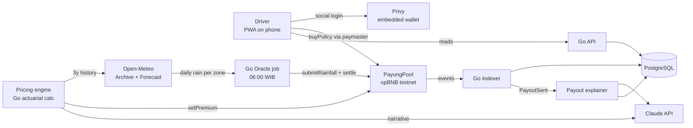
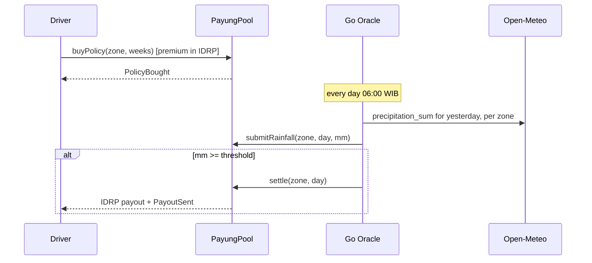

# System Architecture: Payung

Last updated: 17 September 2026

## Overview

Three deployable units plus one on-chain contract. The contract is the source of truth for money. The Go backend is both the oracle (writes rainfall, triggers settlement) and the read API for the web app (indexes contract events into Postgres). The Next.js app never talks to the RPC for reads; it reads from the API and only sends one write transaction type (buy policy), which is gas-sponsored.

Design rule: the contract decides who gets paid. The backend supplies facts (rainfall) and pushes buttons (settle). The AI never touches money; it prices in advance and explains afterwards.

## System Diagram

## Money Flow

## Tech Stack

### Smart Contract
- Language: Solidity 0.8.26, Foundry
- Libraries: OpenZeppelin `AccessControl`, `ReentrancyGuard`, `SafeERC20`
- Network: opBNB testnet (chain id 5611, RPC `https://opbnb-testnet-rpc.bnbchain.org`), verified on opBNB BscScan
- Contracts: `PayungPool.sol` (core), `IDRP.sol` (mock IDR ERC-20, 18 decimals, 1 IDRP = Rp 1, public mint gated by faucet role)

### Backend
- Runtime: Go 1.22
- HTTP: chi
- DB access: sqlc over pgx
- Chain: go-ethereum (`abigen` bindings generated from Foundry ABI)
- Jobs: single binary `cmd/oracle` run by cron (Railway cron or GitHub Actions schedule); `--once` flag for manual runs
- Config: env vars only, no config files

### Database
- PostgreSQL 16. Chosen over SQLite because the API and the oracle job run as separate processes and both write.
- No cache. Data volume is tiny.

### Rain Data
- Open-Meteo Archive API (`archive-api.open-meteo.com/v1/archive`) for history: `daily=precipitation_sum`, `timezone=Asia/Jakarta`
- Open-Meteo Forecast API (`api.open-meteo.com/v1/forecast`) with `past_days=2` for yesterday's observed value (the archive lags by a few days)
- Zone coordinates are the city center; one point per zone

### AI
- Claude API, model `claude-sonnet-4-6`, called from Go with the official SDK
- Two prompts only: `premium_narrative` and `payout_explainer`. Both return JSON, both have a deterministic fallback string if the API fails, so the product never blocks on the LLM.
- No LLM in the money path. Premium numbers come from `internal/pricing`, a pure function.

### Frontend
- Next.js 15 App Router, TypeScript, Tailwind
- Wallet: Privy (email / Google login, embedded EOA), wagmi + viem for the single write call
- Gas sponsorship: opBNB MegaFuel sponsor policy scoped to `PayungPool.buyPolicy` and `IDRP.faucet`. Fallback if MegaFuel integration exceeds half a day: `POST /relay/buy-policy`, where the driver signs an EIP-712 permit-style message and the backend relayer submits the tx.
- PWA: manifest + service worker for install-to-home-screen

### Infrastructure
- Web: Vercel
- API + oracle + Postgres: Railway
- CI: GitHub Actions running `forge test` and `go test ./...` on push
- Secrets: Railway/Vercel env vars. Never committed.

## Key Design Decisions

- Decision: push-based settlement (contract loops over active policies and transfers).
  - Reason: the demo moment is "rain happens, money appears" with zero driver action. Pull-based would need a claim button, which is the thing Payung exists to remove.
  - Alternative rejected: pull-based `claim()`. Correct at scale, wrong for the demo. Documented as roadmap; the contract caps active policies at 50 per zone so the loop is safe.

- Decision: single backend oracle with a dedicated `ORACLE` role.
  - Reason: 13 days, one developer. Chainlink Functions on opBNB testnet would consume days of integration risk for a property the judges can't verify in a 4-minute video anyway.
  - Alternative rejected: Chainlink Functions, multi-signer attestation. Both on roadmap. The pitch states the limitation plainly.

- Decision: Open-Meteo instead of BMKG.
  - Reason: BMKG's public API is forecast only; observed rainfall needs a registered account and has no stable programmatic interface. Open-Meteo has both archive and recent observed values, per coordinate, free, no key.
  - Alternative rejected: BMKG Data Online (registration, unreliable), commercial weather APIs (cost, key management).

- Decision: premium computed deterministically, LLM only writes the explanation.
  - Reason: an LLM inventing prices is a liability and judges will ask "what if it hallucinates". Actuarial math is 20 lines of Go; the AI value is in making it legible to a driver.
  - Alternative rejected: LLM-driven pricing.

- Decision: mock IDR token with 18 decimals, 1 token = Rp 1.
  - Reason: no IDR stablecoin exists on opBNB testnet. 18 decimals keeps wagmi/viem helpers standard. Display layer formats as rupiah.
  - Alternative rejected: 2-decimal token (mirrors rupiah cents but fights every tooling default).

- Decision: API reads from Postgres, never from RPC.
  - Reason: mobile dashboard must open in under 2 seconds; public testnet RPCs are slow and rate-limited. The indexer catches up on every oracle run and on API cold start.

- Decision: PWA, not native.
  - Reason: install without app store, one codebase, 13 days.

## Security Considerations

| Threat | Mitigation |
|---|---|
| Compromised oracle key submits fake rain | `ORACLE` role is separate from `ADMIN`; admin can rotate. Max payout per policy per week is capped in-contract, so worst case damage is bounded. Roadmap: multi-oracle. |
| Reentrancy on payout loop | `ReentrancyGuard` on `settle` and `buyPolicy`; IDRP is a plain ERC-20 with no hooks. |
| Gas griefing via many policies | Hard cap of 50 active policies per zone; `settle` skips insolvent payouts instead of reverting. |
| Same driver, many wallets | Out of scope for MVP (non-goal). Stated in docs. |
| Faucet drain on testnet | 24h cooldown per address, testnet only. |
| Relayer abuse (fallback path) | EIP-712 signature bound to zone, weeks, nonce, deadline; relayer only submits `buyPolicy`. |
| Secrets in frontend | Frontend holds no private keys; Privy manages the embedded wallet. |

## Scalability Plan

1. Move settlement to pull-based with a Merkle root per (zone, day) published by the oracle; drivers or a keeper claim in batches. Removes the 50-policy cap.
2. Multi-oracle: three independent fetchers sign the daily value, contract accepts the median.
3. Per-sub-district zones once a rainfall source with that granularity is available.
4. Liquidity providers deposit into the pool and earn premium spread; requires a proper reserve model.
5. Mainnet on opBNB with a licensed IDR stablecoin.
